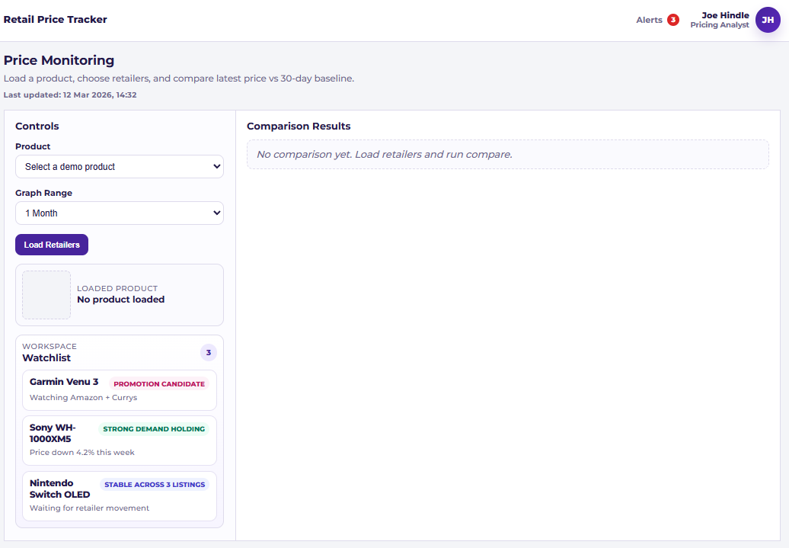
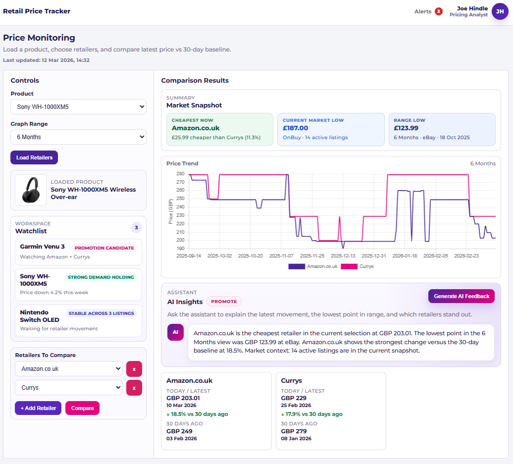

# Retail Price Tracker Dashboard

Flask dashboard that compares live retailer prices for a selected product, shows price movement against a 30-day baseline, and visualizes trend lines over configurable time ranges.

Built to be demo-ready for:
- Recruiters and hiring managers who want a fast product walkthrough.
- New users who want to run locally in a few minutes.

## What It Does

- Loads live retailers for a PriceSpy product ID.
- Compares selected retailers:
  - Latest price
  - Baseline price (closest point 30 days earlier)
  - Percentage movement and direction
- Renders market summary cards:
  - Current cheapest selected retailer
  - Current market low and active listing count
  - Lowest recorded point in the chosen range
- Draws a line chart of daily price points over:
  - 3 months
  - 6 months
  - 12 months
- Includes an AI-insights panel backed by Google Gemini.

## Demo In 60 Seconds

1. Start the app.
2. Open `http://127.0.0.1:5000`.
3. Pick a demo product from the dropdown:
   - `11920424` (Garmin Venu 3)
   - `6219512` (Sony WH-1000XM5)
   - `13549231` (Beats Solo 4)
4. Click `Load Retailers`.
5. Add/remove retailers and click `Compare`.
6. Review:
   - Summary cards
   - Price trend chart
   - Per-retailer result cards
   - AI Insights panel

## Screenshots For Portfolio / Recruitment

Default / non-loaded state:



Loaded / compared state:



One screenshot is enough for a quick overview because this is a single-page dashboard, but two screenshots give a better demo narrative.

## Local Setup

### Requirements

- Python 3.11+ recommended
- Internet access (calls PriceSpy product page and BFF endpoints)

### Install

```bash
python -m venv .venv
.venv\Scripts\activate
pip install flask requests
```

### Run

```bash
set GEMINI_API_KEY=your_key_here
# Optional:
# set GEMINI_MODEL=gemini-2.5-flash
python start.py
```

Then open:

```text
http://127.0.0.1:5000
```

## Project Structure

```text
retail-price-tracker/
  app.py                       # Flask routes + page orchestration
  start.py                     # Local run entrypoint
  services/
    pricespy_client.py         # HTTP client for PriceSpy page + BFF GraphQL
    price_service.py           # Data access + transforms + chart/comparison builders
    comparison_service.py      # Summary/terminal metric helpers
  templates/
    index.html                 # Single-page dashboard template
  static/
    css/dashboard.css          # Dashboard styling
    js/dashboard.js            # Chart + dynamic UI + AI preview interaction
```

## How The App Flows

1. User selects product and range in the form (`app.py`).
2. Backend loads product preview and available shops (`price_service.py`).
3. On compare:
   - Histories are fetched in batches from PriceSpy BFF.
   - Comparison rows are built (latest vs 30-day baseline).
   - Chart data is expanded to daily points.
   - Market summaries are computed.
4. Template renders server-provided data (`templates/index.html`).
5. Frontend enhances UI:
   - Chart.js rendering
   - Dynamic retailer selectors
   - AI feedback request/response rendering

## Notes And Limitations

- Data source is external and may change or intermittently fail.
- No persistent database; all data is fetched live per request.
- AI feedback depends on a valid `GEMINI_API_KEY`.
- No automated test suite is included yet.

## Why This Is Useful In A Hiring Demo

- Shows full-stack thinking in a compact app:
  - Python service/data layer
  - Flask server rendering
  - Frontend interaction and charting
- Demonstrates practical tradeoffs:
  - Fallback data extraction
  - Batched history fetches for efficiency
  - UX optimized for one-screen operator workflow

## Suggested Next Improvements

1. Add structured JSON validation for AI responses (decision + rationale fields).
2. Add test coverage for `price_service.py`.
3. Add retry/backoff and clearer upstream error handling.
4. Add a short-lived cache for repeated product/shop history calls.
